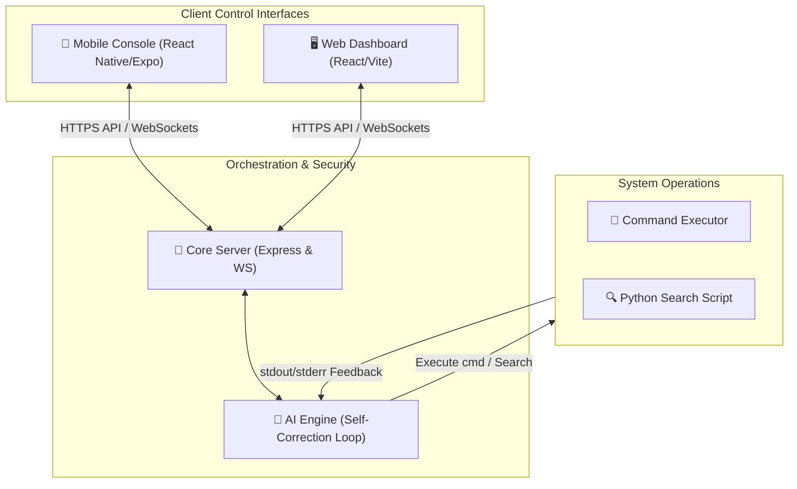

# 🌌 Nexus Ecosystem

Welcome to the **Nexus Ecosystem**—a unified console controller platform that links a React Native Mobile App and a React/Vite Web Dashboard to a self-correcting Express/TypeScript Backend Server to run local shell operations, desktop searches, and monitor host system metrics securely.

---

## 🏗️ Ecosystem Architecture

Nexus is divided into three key layers:



1. **🔌 Core Backend Server ([backend](file:///d:/Coding/PROJECTS/NExt/Nexus_v2/backend/README.md))**:
   The central router. It runs an Express API server alongside a WebSocket broadcasting server on port `3100`. It coordinates authentication, schedules system commands, searches local directories, and runs an intelligent self-correcting AI loop.
2. **🖥️ Web Frontend ([frontend](file:///d:/Coding/PROJECTS/NExt/Nexus_v2/frontend/README.md))**:
   A dark-themed developer cockpit built with React and Vite. It connects to the backend over REST/WebSockets to request shell tasks, view live execution states, and format terminal output logs.
3. **📱 Mobile Console App ([nexus-app](file:///d:/Coding/PROJECTS/NExt/Nexus_v2/nexus-app/README.md))**:
   A premium dark-themed React Native/Expo app that provides remote system orchestration. High-risk commands (like shutdowns) are gated behind device biometric scanners.

---

## ⚡ Unified Key Features

- **🧠 Self-Correcting Execution (`AskAI`)**: When the LLM generates a script or terminal command, the backend executes it locally. If errors (`stderr`) occur, they are automatically captured and fed back to the AI context to correct and retry on-the-fly (up to a configured retry limit).
- **🔒 Biometric Control Guards**: Device-level authorization utilizing `expo-local-authentication` prevents accidental or unauthorized execution of critical system events (e.g., `"shutdown"` or `"turn off"`) unless the mobile user passes a fingerprint or face scan.
- **🔍 Desktop App Search**: Integrates a Python 3 script (`search.py`) that lists, matches, and returns localized application paths based on text patterns via command-line directory searches.
- **⚡ Live Worker Telemetry**: State tags (e.g., `ai_data` signaling what the server is currently `workingon` and `ai_done` once complete) are broadcasted to all connected clients via persistent WebSockets in real time.
- **🛡️ Secure APIs**: Routes are protected globally via middleware validation and Bearer tokens matched against key variables.

---

## ⚙️ Combined Environment Setup

Configure the environment files for each project component:

### 1. Backend (`backend/.env`)
```env
PORT=3100
NEXUS_API_KEY=your_secure_bearer_token
```

### 2. Web Frontend (`frontend/.env`)
```env
VITE_NEXUS_API_KEY=your_secure_bearer_token
```

### 3. Mobile Console App (`nexus-app/.env`)
```env
EXPO_PUBLIC_NEXUS_API_KEY=your_secure_bearer_token
```

---

## 🏃 Orchestrated Quickstart

You can start the entire ecosystem in parallel using concurrently configured scripts inside the backend root.

### Step 1: Install Dependencies
Install packages in the root-level directories:
```bash
# Install Backend packages
cd backend
npm install

# Install Web Frontend packages
cd ../frontend
npm install

# Install Mobile App packages
cd ../nexus-app
npm install
```

### Step 2: Run the Ecosystem
From the `backend/` directory, you can choose how to launch the components:

| Command | Action |
| :--- | :--- |
| **`npm run all`** | **Starts everything concurrently** (Python NIM proxy, Backend server, Web Frontend, and Mobile Expo app). |
| `npm run dev` | Runs the Backend server and the Python NIM proxy concurrently. |
| `npm run dev:server` | Starts only the Express/WS server in watch mode. |
| `npm run frontend` | Navigates to and runs the React web console locally. |
| `npm run app` | Navigates to and runs the Expo mobile app bundle. |
