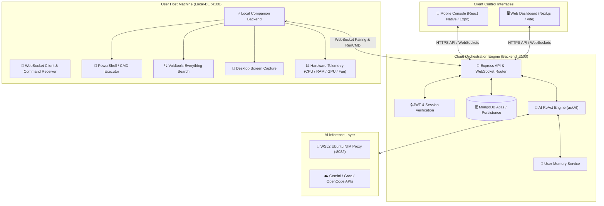

# 🌌 Nexus Ecosystem

Welcome to the **Nexus Ecosystem**—a unified console controller and autonomous AI platform that links a **React Native / Expo Mobile App** and a **Next.js / Vite Web Dashboard** to an intelligent **Express / TypeScript Backend Server** and a **Local Companion Backend (`Local-BE`)** to run host shell operations, desktop searches, screen analysis, and hardware diagnostics securely.

---

## 🏗️ Ecosystem Architecture

Nexus is organized into a distributed multi-tier architecture:


```mermaid
graph TD
    subgraph Clients ["Client Control Interfaces"]
        App["📱 Mobile Console (React Native / Expo)"]
        Web["🖥️ Web Dashboard (Next.js / Vite)"]
    end

    subgraph Central ["Cloud Orchestration Engine (Backend :3100)"]
        Server["🔌 Express API & WebSocket Router"]
        Auth["🔒 JWT & Session Verification"]
        DB[(🗄️ MongoDB Atlas / Persistence)]
        AI["🧠 AI ReAct Engine (askAI)"]
        Memory["🧠 User Memory Service"]
    end

    subgraph Host ["User Host Machine (Local-BE :4100)"]
        LocalBE["⚡ Local Companion Backend"]
        WSClient["📡 WebSocket Client & Command Receiver"]
        Shell["🐚 PowerShell / CMD Executor"]
        Search["🔍 Voidtools Everything Search"]
        Screen["📸 Desktop Screen Capture"]
        SysInfo["📊 Hardware Telemetry (CPU / RAM / GPU / Fan)"]
    end

    subgraph Inference ["AI Inference Layer"]
        WSL["🐧 WSL2 Ubuntu NIM Proxy (:8082)"]
        CloudAI["☁️ Gemini / Groq / OpenCode APIs"]
    end

    %% Client communication
    App <-->|HTTPS API / WebSockets| Server
    Web <-->|HTTPS API / WebSockets| Server

    %% Companion communication
    LocalBE <-->|WebSocket Pairing & RunCMD| Server

    %% Internal Backend flow
    Server <--> Auth
    Server <--> DB
    Server <--> AI
    AI <--> Memory
    AI <--> Inference

    %% Local operations
    LocalBE --> Shell
    LocalBE --> Search
    LocalBE --> Screen
    LocalBE --> SysInfo
```

---

## 📦 Component Overview

| Component | Path | Default Port | Description |
| :--- | :--- | :--- | :--- |
| **Cloud Backend** | [`backend/`](file:///d:/Coding/PROJECTS/NExt/Nexus_v2/backend) | `3100` | Express REST API, WebSocket hub, JWT auth, MongoDB persistence, AI ReAct loop (`askAI`), and companion command routing. |
| **Local Companion** | [`Local-BE/`](file:///d:/Coding/PROJECTS/NExt/Nexus_v2/Local-BE) | `4100` | Native host executor running on user's PC: handles shell commands (`in_built`), Voidtools search (`search`, `search_app`), system telemetry (`system_info`), and screenshot capture (`capture_screen`). |
| **Web Frontend** | [`frontend/`](file:///d:/Coding/PROJECTS/NExt/Nexus_v2/frontend) | `3000` / `5173` | Dark-themed developer dashboard for chat, real-time command streaming, and device management. |
| **Mobile App** | [`nexus_app_v2/`](file:///d:/Coding/PROJECTS/NExt/Nexus_v2/nexus_app_v2) | — | React Native remote console with biometric security guards for critical system operations. |
| **AI NIM Proxy** | `~/fcc/nvidia-nim` | `8082` | Fast local AI inference server running in WSL2 Ubuntu. |

---

## ⚡ Key Capabilities & Features

1. **🧠 Self-Correcting Execution (`AskAI`)**:
   - The AI generates JSON command structures, routes them to `Local-BE`, and receives standard output and errors (`stderr`).
   - If an error occurs, it is automatically fed back to the AI context to correct, refine, and retry on-the-fly.

2. **⚡ Instant Local-BE Disconnection Awareness**:
   - When a user asks for host operations (searching apps, taking screenshots, running terminal commands, checking CPU/GPU), `sendCmdRequest` verifies connection status instantly.
   - If `Local-BE` is offline or disconnected, the AI immediately receives structured feedback and notifies the user to start their local companion server without hanging.

3. **📸 Visual Screen Context & Summarization**:
   - `capture_screen` captures the host display via `Local-BE`, streams base64 image data to the backend, and uses Gemini Vision to provide instant conversational screen understanding.

4. **🧠 Isolated User Memory Persistence**:
   - User aliases, preferred folder directories, application shortcuts, and facts are stored in MongoDB scoped strictly to each user's `userId`, preventing cross-user data leakage.

5. **🔒 Security & Authentication**:
   - Protected API routes via JWT Bearer authentication, session ownership checks, and device pairing token verification.

---

## ⚙️ Environment Configuration

Set up `.env` files in each respective directory:

### 1. Cloud Backend (`backend/.env`)
```env
PORT=3100
MONGO_URI=mongodb+srv://<username>:<password>@cluster.mongodb.net/nexus
JWT_SECRET=your_super_secret_jwt_key
GEMINI_API=your_gemini_api_key
GROQ_KEY_COLLEGE_WISE=your_groq_api_key
```

### 2. Local Companion (`Local-BE/.env`)
```env
PORT=4100
CLOUD_BACKEND_WS=ws://localhost:3100
```

### 3. Web Frontend (`frontend/.env.local`)
```env
NEXT_PUBLIC_BACKEND_URL=http://localhost:3100
NEXT_PUBLIC_WS_URL=ws://localhost:3100
```

### 4. Mobile App (`nexus_app_v2/.env.local`)
```env
EXPO_PUBLIC_BACKEND_URL=http://<YOUR_LOCAL_IP>:3100
```

---

## 🛠️ Prerequisites & System Dependencies

For full host execution capabilities on Windows:

1. **[Voidtools Everything](https://www.voidtools.com/)**:
   - Install and ensure Voidtools Everything is running in the Windows system tray. Required for sub-second global file and app searching.
2. **AudioDeviceCmdlets (PowerShell Module)**:
   - Run in PowerShell (Admin):
     ```powershell
     Set-ExecutionPolicy RemoteSigned -Scope CurrentUser
     Install-Module -Name AudioDeviceCmdlets -Force
     ```
3. **WSL2 Ubuntu (for local NIM AI proxy)**:
   ```powershell
   wsl --install -d Ubuntu
   ```

---

## 🏃 Quickstart

### Step 1: Install Dependencies
```bash
# Backend
cd backend && npm install

# Local Companion
cd ../Local-BE && npm install

# Frontend
cd ../frontend && npm install

# Mobile App
cd ../nexus_app_v2 && npm install
```

### Step 2: Run the Ecosystem
From the `backend/` directory:

| Command | Description |
| :--- | :--- |
| **`npm run dev:server`** | Starts the Express & WebSocket Cloud Backend on port `3100`. |
| **`cd ../Local-BE && npm run dev`** | Starts the Local Companion host server and connects to the backend. |
| **`npm run frontend`** | Launches the Web Frontend development server. |
| **`npm run app`** | Launches the Expo mobile application bundle. |
| **`npm run proxy`** | Starts the WSL2 Python NIM AI proxy on port `8082`. |
| **`npm run all`** | Launches Backend, Frontend, Mobile packager, and Proxy concurrently. |

---

## 🗺️ Active Roadmap & Next Priorities

- [ ] **Device Token Pairing Flow**: One-time 6-character pairing code generation from web settings exchanged for 30-day device tokens on `Local-BE`.
- [ ] **MongoDB Chat Context Migration**: Migrate `askAI.ts` from local file-based JSON histories to MongoDB `ChatModel` documents.
- [ ] **Targeted WebSocket Session Routing**: Route AI streaming status tags (`ai_data`, `workingon`) specifically to the client with the active session.
- [ ] **Persistent Terminal Working Directory (CWD)**: Maintain active shell directory state across sequential AI commands.
- [ ] **Execution Diagnostics Separation**: Persist pure conversational messages in chat history while isolating technical logs into execution records.
