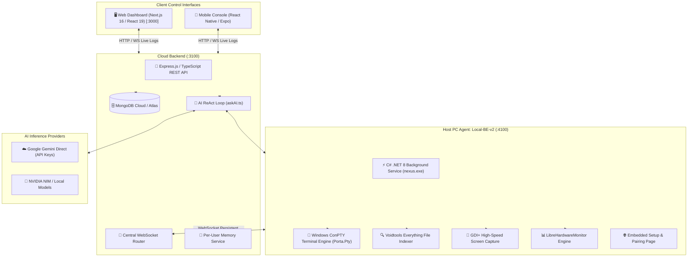

# 🌌 Nexus v2 — Autonomous Local & Cloud AI Operating System

[](https://github.com/Kashif-Coder404/nexus-v2)
[](https://microsoft.com/windows)
[](LICENSE)

> **In One Simple Line:** Nexus is a self-healing, multi-agent desktop assistant and companion operating system that bridges cloud LLMs with host-level Windows capabilities (native PowerShell, ConPTY pseudoterminals, screen inspection, file indexing, and telemetry) through real-time WebSockets.

---

## 🏗️ System Architecture


```mermaid
graph TD
    subgraph Clients ["Client Control Interfaces"]
        Web["🖥️ Web Dashboard (Next.js 16 / React 19) [:3000]"]
        Mobile["📱 Mobile Console (React Native / Expo)"]
    end

    subgraph CloudGateway ["Cloud Backend (:3100)"]
        Server["🔌 Express.js / TypeScript REST API"]
        WSHub["📡 Central WebSocket Router"]
        DB[(🗄️ MongoDB Cloud / Atlas)]
        Orchestrator["🧠 AI ReAct Loop (askAI.ts)"]
        Memory["🧠 Per-User Memory Service"]
    end

    subgraph HostAgent ["Host PC Agent: Local-BE-v2 (:4100)"]
        Agent["⚡ C# .NET 8 Background Service (nexus.exe)"]
        ConPTY["🐚 Windows ConPTY Terminal Engine (Porta.Pty)"]
        Search["🔍 Voidtools Everything File Indexer"]
        Vision["📸 GDI+ High-Speed Screen Capture"]
        Telemetry["📊 LibreHardwareMonitor Engine"]
        LocalUI["🌐 Embedded Setup & Pairing Page"]
    end

    subgraph ModelBridge ["AI Inference Providers"]
        GoogleAPI["☁️ Google Gemini Direct (API Keys)"]
        LocalNIM["🐧 NVIDIA NIM / Local Models"]
    end

    %% Networking Links
    Web <-->|HTTP / WS Live Logs| CloudGateway
    Mobile <-->|HTTP / WS Live Logs| CloudGateway
    HostAgent <-->|WebSocket Persistent Tunnel| WSHub
    
    CloudGateway <--> DB
    CloudGateway <--> Orchestrator
    Orchestrator <--> ModelBridge
    Orchestrator <--> HostAgent
    
    HostAgent --> ConPTY
    HostAgent --> Search
    HostAgent --> Vision
    HostAgent --> Telemetry
```

---

## 🧩 Component Directory & Ports

| Component | Tech Stack | Port | Primary Responsibility |
| :--- | :--- | :--- | :--- |
| **`frontend/`** | Next.js 16, React 19, Tailwind v4, Zustand | `3000` | Orbital Purple cockpit for chat, execution steps, and live streaming terminals. |
| **`backend/`** | Node.js, Express, TypeScript, Mongoose | `3100` | Gateway, WebSocket router, auth, session persistence, and self-correcting `askAI` loop. |
| **`Local-BE-v2/`** | C# (.NET 8), ConPTY, P/Invoke, Win32 | `4100` | Native host companion: executes shell commands, inspects desktop screen, and runs system telemetry. |
| **`nexus_app_v2/`** | React Native, Expo | — | Companion mobile client for remote system monitoring and biometric commands. |

---

## 🚀 How to Run the Ecosystem

### 1. Prerequisites
- **Node.js** >= v20.x
- **.NET 8 SDK** (for `Local-BE-v2`)
- **MongoDB** running locally or a MongoDB Atlas URI
- Windows 10/11 with Administrator privileges

### 2. Booting Services

Open 3 separate terminal windows:

#### Terminal 1: Cloud Backend
```powershell
cd d:\Coding\PROJECTS\Next\Nexus_v2\backend
npm run dev
# Server listening on http://localhost:3100
```

#### Terminal 2: Local Agent (Must run as Administrator)
```powershell
# Open an elevated PowerShell terminal:
cd d:\Coding\PROJECTS\Next\Nexus_v2\Local-BE-v2
dotnet watch -- --service
# Agent connects to ws://localhost:3100 and serves local setup on http://localhost:4100
```

#### Terminal 3: Web Frontend
```powershell
cd d:\Coding\PROJECTS\Next\Nexus_v2\frontend
npm run dev
# Dashboard available at http://localhost:3000
```

---

## ⚡ Core Capabilities & Protocols

### 1. Autonomous Execution & Unwrapped Native PowerShell
- Nexus translates user requests into native PowerShell cmdlets (`Get-ChildItem`, `Move-Item`, `Start-Process`).
- `unwrapper` in `Parsers.ts` strips double-wrapped quoting bugs to preserve PowerShell variables (`$downloads`, `$_`).
- `cleanTerminalOutput` converts ConPTY cursor repositioning codes (`\x1b[6;1H`) into real newlines and strips ANSI noise, keeping terminal logs human-readable.

### 2. Task Lifecycle: Fast vs. Background vs. Daemon
- **Synchronous (<5s)**: Fast operations (listing files, creating folders) return immediately to the AI.
- **Background Tasks (>5s)**: Long tasks (compiling, downloading, moving archives) are promoted to background tasks with live streaming chunks (`cmd_chunk`) over WebSockets.
- **Daemons (`isDaemon: true`)**: Persistent servers (`npm run dev`) start detached with PID tracking and live logs.

### 3. Desktop Screen Capture & Multimodal Vision
- Captures full-resolution desktop screens via GDI+ into memory in <15ms.
- Summarizes visual errors/windows with Gemini Vision and sends textual feedback to the reasoning loop.
- Passes the base64 preview to the frontend while stripping large base64 tokens from subsequent conversation history.

---

## 📁 Project Structure

```
Nexus_v2/
├── backend/                  # Node.js TypeScript API & Orchestrator
│   ├── AI/                   # askAI loop, CallAI router, instructions, parsers
│   ├── db/                   # Mongoose schemas (chat, user, session, memory)
│   ├── routes/               # Express REST routes
│   └── services/             # WebSocket router, chat history, JWT auth
├── Local-BE-v2/              # Native C# .NET 8 Host Companion
│   ├── services/             # ExecuteServices (ConPTY), WebSocketClientService, Search
│   ├── Models/               # DTOs and command definitions
│   └── SetupPage/            # Embedded single-file setup dashboard
├── frontend/                 # Next.js 16 Web Dashboard
│   ├── app/                  # App router (chat, workbench, dashboard, devices)
│   ├── app/components/       # ChatUI, AIMsgBox, ExecutionsStep, XTerminal
│   └── services/             # WebSocket client, HTTP services
├── README.md                 # Project architecture and setup guide (This file)
└── TASKS.md                  # Master prioritized roadmap & progress tracker
```

---

## 📄 License
MIT © 2026 Nexus Ecosystem