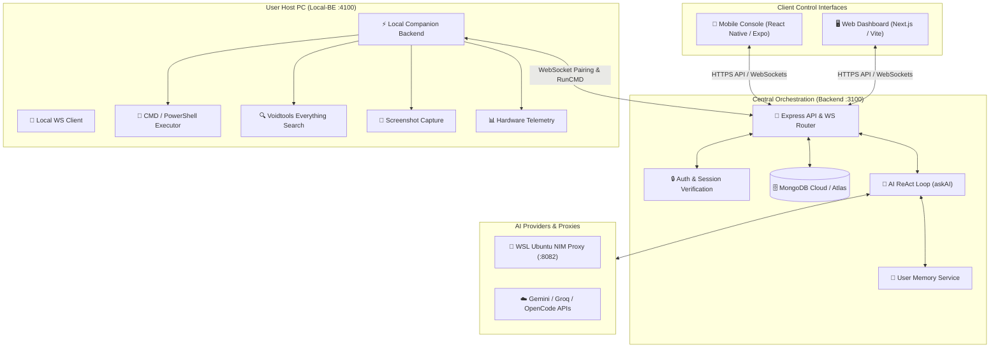

# 🌌 Nexus Ecosystem — Master Consolidated Report (`main.md`)

> **Generated on:** August 31, 2026  
> **Repository:** `Nexus_v2`  
> **Status:** Active Development & Stabilization  

---

## 📑 Executive Summary

The **Nexus Ecosystem** is a multi-platform autonomous console and assistant architecture. It connects client interfaces (**Next.js Web Dashboard** and **React Native/Expo Mobile App**) with a central **Cloud Express/TypeScript Backend Server**, a **Local Companion Backend (`Local-BE`)** running on the user's host PC, and a **Python/WSL AI Proxy** for local model execution.

This document synthesizes all project requirements, architectural goals, resolved fixes, and active technical debt consolidated across all project markdown files (`README.md`, `MAIN_GOAL.md`, `TODO_AUTH_SYSTEM.md`, `todo.md`, `backend/ISSUES.md`, `backend/TODO.md`, `FreshInstall.md`, and `backend/middlewares_todo.md`).

---

## 🏗️ System Architecture & Data Flow



---

## 📊 Component Mapping

| Component | Directory | Port | Primary Responsibility |
| :--- | :--- | :--- | :--- |
| **Cloud Backend** | `backend/` | `3100` | Express REST API, WebSocket hub, JWT auth, MongoDB persistence, AI orchestration (`askAI`), and command routing. |
| **Local Companion BE** | `Local-BE/` | `4100` | Host PC command execution (`in_built`), Voidtools search (`search`, `search_app`), system telemetry (`system_info`), and screen capture (`capture_screen`). |
| **Web Frontend** | `frontend/` | `3000` / `5173` | Dark-themed web cockpit for live chat, execution logs, and device management. |
| **Mobile App** | `nexus_app_v2/` | — | Remote mobile management with biometric guards for high-risk system commands. |
| **AI NIM Proxy** | `~/fcc/nvidia-nim` (WSL) | `8082` | Local fast inference proxy via Uvicorn/FastAPI. |

---

## ✅ Completed & Verified Implementations

### 1. Local-BE Command Routing & Instant Offline Detection
- **Fail-Fast Offline Check:** In [`backend/services/websocket.service.ts`](file:///d:/Coding/PROJECTS/NExt/Nexus_v2/backend/services/websocket.service.ts), `sendCmdRequest` immediately checks for an authenticated WebSocket client for the requesting `userId`. If offline, it rejects instantly without waiting for a 30-second timeout.
- **Local Routing in Parsers:** In [`backend/AI/Parsers.ts`](file:///d:/Coding/PROJECTS/NExt/Nexus_v2/backend/AI/Parsers.ts), local machine commands (`search`, `search_app`, `system_info`, `in_built`, `capture_screen`) route through `sendCmdRequest`.
- **Vision Summarizer for Remote Screenshots:** Local-BE captures base64 screenshots and sends them to the backend, which summarizes visual context with Vision AI models via [`image.summarizer.ts`](file:///d:/Coding/PROJECTS/NExt/Nexus_v2/backend/AI/Helper/image.summarizer.ts).
- **AI Local Backend Awareness:** Updated [`main.Instructions.ts`](file:///d:/Coding/PROJECTS/NExt/Nexus_v2/backend/AI/instructions/main.Instructions.ts) to train the model on local execution failures, prompting the user when their local companion server is not running.

### 2. User-Scoped Memory Isolation
- **Schema Update:** Added indexed `userId` to [`memory-schema.ts`](file:///d:/Coding/PROJECTS/NExt/Nexus_v2/backend/db/schema/memory-schema.ts) to isolate alias, folder, and fact storage per user.
- **Service Scoping:** Updated `updateMemory`, `getMemory`, and `deleteMemory` in [`memory.service.ts`](file:///d:/Coding/PROJECTS/NExt/Nexus_v2/backend/services/memory.service.ts) to enforce `userId` scoping outside `$or` conditions to prevent cross-user data leakage and accidental bulk deletions.
- **Gateway Normalization:** Created `accessMemory(userId, action, alias, value, category)` to safely route and clean inputs for memory CRUD operations.

### 3. Core Backend Middlewares & Authentication
- **JWT Authentication:** Stateful user authentication with bcrypt password hashing and token generation.
- **Verification Guards:** Created `userAuthentication`, `sessionAuthentication`, and `chatVerification` middlewares.
- **Dynamic Env Discovery:** Centralized environment resolution in `EnvVariables.ts`.

---

## 🔴 Consolidated Open Issues & Technical Debt

### Category 1: Device Pairing & Companion Authentication (`TODO_AUTH_SYSTEM.md`)
1. **Device Code Pairing Flow:**
   - Implement `DeviceCode` schema (`backend/db/schema/device-code-schema.ts`) with a 5-minute TTL index.
   - Implement `POST /api/auth/device-code` for web dashboard code generation (e.g., `NX-8F3K2A`).
   - Implement `POST /api/auth/device-link` to exchange pairing codes for persistent 30-day device tokens.
2. **Local-BE Token Management:**
   - Store device token in `Local-BE/deviceToken.json`.
   - On WebSocket connection, send `Authorization: Bearer <token>` in headers.
   - Implement auto token refresh over WebSocket on day 25 before expiry.
3. **Web UI Device Manager:**
   - Add "Linked Devices" list in settings to view online status and revoke devices remotely.

---

### Category 2: Chat History & MongoDB Synchronization (`backend/ISSUES.md`)
1. **Migrate `askAIv2.ts` from File-Based to MongoDB:**
   - Transition `askAI.ts` and `askAIv2.ts` from `LocalChatHistory.ts` (`backend/AI/chats/chat_*.json`) to `chat.history.service.ts` (`ChatModel.findOneAndUpdate`).
2. **Missing Chat History API Endpoint:**
   - Register `GET /api/chat/history/:sessionId` (or `POST /api/chat/history`) to load chat histories into the web and mobile frontends.
3. **Payload Structure Separation (Conversational vs. Diagnostics):**
   - Save pure conversational text (`msg`) to `ChatModel` for UI rendering.
   - Store command execution diagnostics (`cmd`, `terminalOutput`, `terminalError`, exit codes) in an execution log collection or metadata field so raw JSON does not pollute user chat history.
4. **Chat Session Auto-Initialization:**
   - If a user sends a message to a newly created session ID that has no MongoDB document yet, auto-initialize the chat document instead of throwing `401: Chat is not Found!`.

---

### Category 3: Terminal State & Shell Persistence (`todo.md`)
1. **Persistent CWD Tracking:**
   - When the AI runs `cd <path>`, the child process exits and forgets the working directory.
   - Implement persistent directory state tracking in `execute.service.ts` per session/user, passing the active `cwd` into subsequent child processes.
2. **Global App Search Coverage:**
   - Standardize search path patterns in `search.py` to index common custom directories (`D:/Games`, `D:/Apps`, `C:/Users/<User>/Desktop/APPS`) without hardcoding specific developer paths.

---

### Category 4: WebSocket Session Routing & Visibility (`todo.md`, `backend/TODO.md`)
1. **Targeted WebSocket Routing:**
   - Currently, `websocket.service.ts` broadcasts all AI telemetry globally (`broadCastMessage`).
   - Route `ai_data`, `workingon`, and terminal output streams specifically to the WebSocket client matching the requesting `userId` and `sessionId`.
2. **Intermediate Execution Visibility:**
   - Stream intermediate tool executions, stdout snippets, and errors to the active frontend in real time as the AI loop progresses.

---

### Category 5: Zero-Loss Disaster Recovery & Clean-Slate Setup (`MAIN_GOAL.md`, `FreshInstall.md`)
1. **Standardized `.env.example` Templates:**
   - Provide complete `.env.example` files across `backend/`, `frontend/`, `Local-BE/`, and `nexus_app_v2/`.
2. **External Proxy Dependency Packaging:**
   - Package the WSL Python NIM proxy setup into a self-contained `requirements.txt` / `pyproject.toml` script within the repository.
3. **Unified 1-Command Bootstrapper:**
   - Create root bootstrap scripts (`setup.ps1` and `runAll.ps1`) to install dependencies and run all sub-projects concurrently.
4. **Disaster Recovery Runbook:**
   - Document step-by-step procedures for setting up native dependencies (**Voidtools Everything DLL**, **AudioDeviceCmdlets PowerShell module**, and **WSL2 Ubuntu**).

---

## 🎯 Implementation Priority Matrix

```
┌────────────────────────────────────────────────────────────────────────┐
│                        PRIORITY ROADMAP                                │
├───────────┬──────────────────────────────────────────────┬─────────────┤
│ Priority  │ Task Description                             │ Target Path │
├───────────┼──────────────────────────────────────────────┼─────────────┤
│ 🔥 P0     │ Fix Parsers.ts memory_read / delete calls    │ backend/    │
│           │ Complete MongoDB Chat Migration (askAI.ts)   │ backend/    │
│           │ Add GET /api/chat/history endpoint           │ backend/    │
├───────────┼──────────────────────────────────────────────┼─────────────┤
│ ⚡ P1     │ Device Pairing & Token Auto-Refresh (WS Auth)│ Local-BE/   │
│           │ Targeted WebSocket Session Message Routing   │ backend/    │
│           │ Clean Conversational vs Diagnostics payload  │ backend/    │
├───────────┼──────────────────────────────────────────────┼─────────────┤
│ 🛠️ P2     │ Persistent CWD in Command Execution          │ Local-BE/   │
│           │ Frontend Linked Devices Management UI        │ frontend/   │
│           │ Auto-initialize new chat sessions            │ backend/    │
├───────────┼──────────────────────────────────────────────┼─────────────┤
│ 📦 P3     │ Unified Setup & Disaster Recovery Scripts    │ root /      │
│           │ Mobile Biometric Guard & Voice Integration   │ nexus_app/  │
└───────────┴──────────────────────────────────────────────┴─────────────┘
```

---

## 🧪 Validation & Disaster Recovery Protocol

To verify that the entire Nexus Ecosystem is functional from a clean state:

1. **Clone & Environment Setup:**
   ```bash
   git clone <repo-url> Nexus_v2
   # Copy .env.example -> .env in backend/, Local-BE/, frontend/, and nexus_app_v2/
   ```
2. **Native Tool Verification:**
   - Ensure Voidtools Everything is running in the Windows tray.
   - Verify PowerShell AudioDeviceCmdlets: `Get-AudioDevice -List`
   - Verify WSL2 Ubuntu proxy: `curl http://localhost:8082/health`
3. **Launch Ecosystem:**
   ```powershell
   ./runAll.ps1
   ```
4. **Verification Criteria:**
   - [ ] Backend connects to MongoDB (`DB CONNECTED SUCCESSFULLY! ✅`).
   - [ ] Local-BE authenticates and pairs with Backend over WebSocket.
   - [ ] Web dashboard connects and displays live streaming status.
   - [ ] AI executes `system_info`, `search`, and `in_built` commands through Local-BE.
   - [ ] AI gracefully reports offline status when Local-BE is closed.
   - [ ] User memory operations (`memory_write`, `memory_read`, `memory_delete`) persist and isolate per user.
