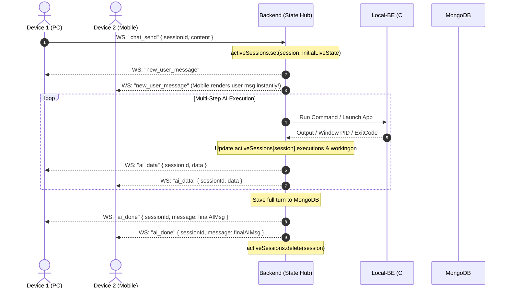

# Nexus v2: Real-Time WebSocket Architecture & Live State Hub
> **Status:** High Priority Architecture Blueprint (To Be Implemented)  
> **Estimated Implementation Time:** ~30 to 45 minutes  
> **Core Concept:** *"The server becomes the frontend during in-flight executions."*

---

## 1. Executive Summary & Core Motivation

Currently, Nexus uses an HTTP `POST /api/chat/message` to trigger conversation, while live diagnostic progress streams over WebSockets. This introduces 3 distributed-systems edge cases:
1. **HTTP Timeouts on Heavy Tasks:** Complex multi-step turns (npm builds, disk traversals, package installs) take >30 seconds. Proxies and browsers drop HTTP requests at 30s (`504 Gateway Timeout`).
2. **Multi-Device Desynchronization:** If User sends a message from PC and views from Mobile (or sends at the same time), Mobile never receives the user message or the final HTTP response payload.
3. **Lost Live State on Reconnection:** If a user closes their laptop/browser or switches chats mid-execution, reopening the chat shows a blank screen because live state lived only in the transient frontend memory.

### The Solution:
Shift conversation lifecycle entirely to **pure WebSockets with an Authoritative Server-Side State Hub**.
The server owns the in-flight state (`workingon`, `cmd`, `executions`, `startedAt`). Any client (PC, Mobile, Reconnected Tab) merely attaches as a live viewer to this state. When finished, it commits to MongoDB and unloads from memory.

---

## 2. Real-Time State Diagram



---

## 3. Data Structures

### In-Memory Server State (`backend/services/websocket.service.ts` or `session.state.ts`)
```typescript
export interface ActiveSessionState {
  userId: string;
  sessionId: string;
  userMessage: string;
  workingon: string;
  cmd: string;
  executions: any[];
  startedAt: number;
  status: "starting" | "running" | "completed";
}

// In-memory map: sessionId -> ActiveSessionState
// ZERO database bloat: exists only while AI is running!
export const activeSessions = new Map<string, ActiveSessionState>();
```

---

## 4. WebSocket Event Protocol Specification

### 1. Client to Server: `chat_send`
Sent when the user clicks Send or hits Enter on any device.
```json
{
  "type": "chat_send",
  "sessionId": "6724a1b2c3d4e5f6a7b8c9d0",
  "content": "Launch Brave and check active network ports",
  "behaviour": "friendly",
  "model": {
    "provider": "gemini",
    "name": "gemini-3.5-flash-lite"
  }
}
```

### 2. Server to All User Devices: `new_user_message`
Immediately broadcasted so all screens (Mobile + PC) display the user message in real-time.
```json
{
  "type": "new_user_message",
  "sessionId": "6724a1b2c3d4e5f6a7b8c9d0",
  "message": {
    "role": "user",
    "content": "Launch Brave and check active network ports",
    "timestamp": "2026-10-02T17:45:00.000Z"
  }
}
```

### 3. Server to All User Devices: `ai_data` (Live Steps)
Broadcasted on every AI step update.
```json
{
  "type": "ai_data",
  "sessionId": "6724a1b2c3d4e5f6a7b8c9d0",
  "data": {
    "workingon": "Launching Brave browser...",
    "cmd": "launch_app -application brave.exe",
    "executions": [
      {
        "steps": 1,
        "msg": "Found 1 app",
        "isSuccess": true,
        "duration": "0.4s"
      }
    ]
  }
}
```

### 4. Server to All User Devices: `ai_done` (Final Completion)
Broadcasted when AI completes. Delivers the final assistant message so Mobile never gets left empty.
```json
{
  "type": "ai_done",
  "sessionId": "6724a1b2c3d4e5f6a7b8c9d0",
  "data": {
    "workingon": "",
    "message": {
      "role": "assistant",
      "content": {
        "lastAIMsg": "Brave has been launched and port 8080 is currently listening.",
        "lastCMD": "launch_app",
        "executions": [...],
        "workedSeconds": 4
      }
    }
  }
}
```

### 5. Client to Server: `sync_session` (Reconnection / Screen Open)
When a user opens Chat A on their phone or refreshes their browser:
```json
{
  "type": "sync_session",
  "sessionId": "6724a1b2c3d4e5f6a7b8c9d0"
}
```
**Server Response (`session_state`):**
```json
{
  "type": "session_state",
  "sessionId": "6724a1b2c3d4e5f6a7b8c9d0",
  "isRunning": true,
  "data": {
    "workingon": "Searching secondary drives for Cyberpunk...",
    "executions": [...]
  }
}
```

---

## 5. File-by-File Implementation Plan

### File 1: `backend/services/websocket.service.ts`
- Implement `activeSessions = new Map<string, ActiveSessionState>()`.
- In `ws.on("message")`, add handler for `case "chat_send":`:
  - Check if `activeSessions.has(data.sessionId)`.
  - If already running: Return current `activeSessions.get(data.sessionId)` so late client immediately hooks into live loading screen without double-running.
  - If free: Set initial state, broadcast `new_user_message`, and invoke `askAI`.
- Add handler for `case "sync_session":` to return current live status to reconnected tabs.

### File 2: `backend/AI/askAI.ts`
- Receive `session` and update `activeSessions.get(session)` on each step:
  ```typescript
  const liveState = activeSessions.get(session);
  if (liveState) {
    liveState.workingon = workingOn;
    liveState.executions = executions;
    liveState.cmd = command;
  }
  ```
- Pass `sessionId: session` in all `sendToUser` broadcasts.

### File 3: `frontend/components/SendMsg.tsx`
- Replace `fetch('/api/chat/message')` with WebSocket send:
  ```typescript
  sendWsJson({
    type: "chat_send",
    sessionId: session,
    content: actualMessage,
    model: { provider: model.provider, name: model.name }
  });
  ```

### File 4: `frontend/services/ws.service.ts`
- In `ai_data`: Check `if (payload.sessionId !== currentSession) return;`
- In `new_user_message`: Append to chat if `sessionId === currentSession`.
- In `ai_done`: Stop spinner and append `payload.data.message` to `useChat` store.
- In `session_state`: Set `workingOn` and `liveExecutions` immediately upon opening/reconnecting to an active chat.

---

## 6. Edge Cases Handled by This Design

| Edge Case | How It Is Resolved |
|---|---|
| **User clicks Send on PC & Mobile simultaneously** | First request claims `activeSessions.set()` at $T=0$. Second request sees active state at $T=15ms$, enters synchronized loading view, and streams the exact same steps. |
| **Heavy task taking >45 seconds** | WebSockets never time out. Zero HTTP proxy 504 errors. |
| **User closes browser tab during turn** | Server and Local-BE continue executing. Upon reopening or switching to phone, `sync_session` restores the live cards instantly. |
| **Mobile viewing chat while PC triggers turn** | `new_user_message` immediately prints the user prompt on Mobile, followed by real-time steps and the final response. |
| **Memory / RAM safety** | State lives in RAM **only while executing**. Deleted immediately via `activeSessions.delete(session)` upon completion. |

---

## 7. Estimated Implementation Time
- **Backend State Store & WS Handlers:** ~15 minutes
- **askAI State Updating:** ~10 minutes
- **Frontend WS Event Hookup:** ~15 minutes
- **Total:** ~35–45 minutes
